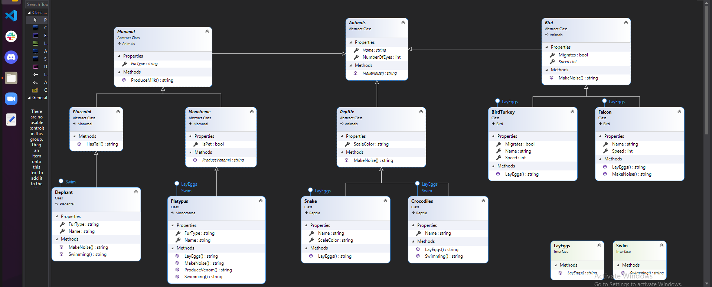

# Zoo-Lab06-Lab07

This project holds a a console app which instantiates several different types of animals built using 
inheritance and implementation. This project serves as an exercise to show how different properties 
and methods can be pieced together using the 4 Object Oriented Principles.

## How do you run the program?
1. Clone repo to your device.
2. Open the solution file Zoo.sln in Visual Studio.
3. To run the app, go to Debug > Start Without Debugging (or press ctrl+F5).

## UML Diagram

## Object Oriented Principles

#### INHERITANCE 
> This states that a class can be built from another (base) class, and in doing so, 
> it 'inherits' all of its members (ie - properties, methods). The Animal class is the 'base' class 
> from which all of the individual animals inherit the properties Species, Name, etc. and the methods 
> MakeNoise. Mammal (an Animal derivative) passes ProduceMilk to its 'child' classes.

#### POLYMORPHISM  
> This states that inherited properties and methods can (in certain cases) be altered 
> (or overridden) once they by the class that derives them.

#### ABSTRACTION 
> This states that a class or inherited property/method can exist for the sole purpose of passing on a template 
to deriving classes. It is something that is only used after inheritance. 
Concrete is the opposite of abstract - it's something that can get used at the level at which it's defined, 
and it absolutely MUST get defined at (or before) the concrete level at which it's instantiated. 
Virtual is the 'in between' answer - it can be overridden by children, but it doesn't have to be. 
Animal class is abstract. One can't build an 'Animal' instance directly - one needs the additional 
properties and methods that are 'built up' by the inheritance chain before there is an adequate template to 
build an instance. 

> A Elephant can be instantiated, and it includes all the properties and methods of all its ancestors 
(Placental, Mammal, and Animal), as well as any properties and methods that are introduced at its own level 
(none in this case, but we could add a uniquely Elephant-like property or method to Elephant, 
and then only Elephant have them). 

#### ENCAPSULATION 
This states that content of all types is both grouped (logically, and per the coder's discretion) and access to that group is controlled as:

- Public - any group (class) can access it (all custom classes in this application are public)
- Private - access is limited to inside the group (class) for which 'private' is specified (not used in this application)
- protected - access is limited to inside the group (class) and any derivatives of it (not used in this application)

#### INTERFACES
>Like classes, interfaces are collections of members that can be inherited by deriving classes. 
Like abstract classes, an interface can't be instantiated, and its members must be resolved before a 
concrete descendent is instantiated. Unlike abstract classes, an interface can contain only properties and 
methods, and it's intended to address only behaviors (rather than characteristics) of derived instances. 
Also unlike abstract classes, a deriving class can inherit from an unlimited number of interfaces 
(it isn't bound by the single inheritance rule governing classes). The real power of an interface is 
that it offers common (ie - library) behaviors that can enable interaction between objects of dissimilar 
classes.

In this project, interfaces are demonstrated through LayEggs AND Swim... Mostly animals Lay Eggs.